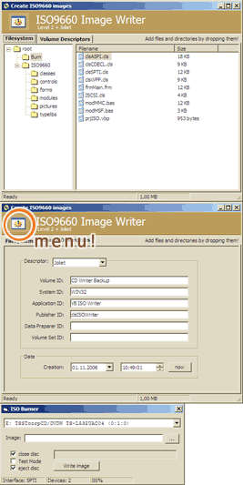



## Data CD Writer

### Description

This creates ISO9660 file system images and optionally burns them on CD-R(W) (2 projects).

FlamedLib is still pretty buggy, so I decided

to rewrite the ISO9660 class.

Now it should be a lot faster and also

a lot safer. /// 1. After downloading, open ISO9660\prjISOImageWriter.vbp. If VB can't find something, add a reference to typelibs\OleGuids3.tlb.

Now the project should load.

/// 2. Add some files or directories (you can also explore the right click menus...), when you're finished with your image,

click on the picture on the top left and chose "Create ISO Image". You shouldn't add big files to the image as this would take some time to copy it to the image. /// 3. Open Burn\prjISO.vbp.

If you're on a Win 9x/Me machine, you must have installed an ASPI layer (preferably the one from Adaptec, probably already installed), if you're using any newer Windows version, make sure you got Administrator priviledges, else you need a working ASPI layer (quite a hard task on Win XP).

Chose your CD writer and the ISO image to write to the CD-R(W), and click "Write image". The write speed is defined as 8x, but you can easily change it in the source (if you got the guts) 

----

This project uses the generic commands specified by the T10 technical comittee,

all drives produced after 2000/2001 should be compatible. If not, there won't be any damage (maybe your CD-R will be unusable afterwards).
 
### More Info
 

             |
---                |---
**Submitted On**   |2006-10-26 14:00:48
**By**             |[Arne Elster](https://github.com/Planet-Source-Code/PSCIndex/blob/master/ByAuthor/arne-elster.md)
**Level**          |Advanced
**User Rating**    |4.9 (200 globes from 41 users)
**Compatibility**  |VB 6\.0
**Category**       |[Complete Applications](https://github.com/Planet-Source-Code/PSCIndex/blob/master/ByCategory/complete-applications__1-27.md)
**World**          |[Visual Basic](https://github.com/Planet-Source-Code/PSCIndex/blob/master/ByWorld/visual-basic.md)
**Archive File**   |[Data\_CD\_Wr2028081112006\.zip](https://github.com/Planet-Source-Code/arne-elster-data-cd-writer__1-66945/archive/master.zip)

